# ⏳ TIEMPOS PASADOS

"Un minuto para dejar atrás lo que te atormenta. ¿Podrás hacerlo a tiempo?"

Este juego es una experiencia corta pero intensa sobre el peso del pasado y la lucha interna por soltarlo. En un mundo cubierto de bruma, cada paso es incierto hasta que decides enfrentar lo que te retiene. Activando los monumentos, desvaneces la niebla de la culpa y los reproches, abriendo camino hacia la claridad.

El tiempo es limitado. Si logras activar todos los monumentos antes de que el reloj llegue a cero, habrás vencido la batalla interna. Si no, la bruma volverá a cubrirlo todo.

---

## 🌀 METÁFORA Y SIGNIFICADO

La bruma representa los recuerdos que nos persiguen, aquellos pensamientos que nos nublan la mente y nos impiden avanzar. Cada monumento activado es un acto de liberación: aceptar, perdonar y soltar.

Este juego explora el impacto emocional del auto-reproche y la importancia del perdón. A veces, el mayor obstáculo no es el mundo exterior, sino lo que cargamos dentro.

---

## 🎮 CONTROLES

- ▶️ **Movimiento**: `W, A, S, D`
- 🔓 **Soltar el pasado**: `E`
- ⏸️ **Pausar Juego**: `P`

---

## 👥 CRÉDITOS

**Desarrolladores:**

- 🎨 **Jhonatan Stibe Garzón** - Desarrollador Unity, Arte y Animaciones  
- 🖥️ **Johanna Carolina Ballen** - Desarrolladora Unity, UI  
- 🎮 **Jhoan Andres Diaz** - Desarrollador Unity, Gameplay Programmer  
- 🖥️ **Jose David Carranza** - Desarrollador Unity, UI  

---

## 🎨 ASSETS

- 🏞️ **Tilemaps** - Kenney  
- 🎭 **Personaje/Animaciones** - Jhonatan Garzón  
- 🖌️ **UI** - Mounir Tohami  

---

## 🎵 AUDIO

- 🎶 **Sonidos** - clideo.com, Pixabay, Conrad  

---

## 🛠️ HERRAMIENTAS

- 🎮 Unity 6
- 🎨 Aseprite
- 🖼️ Photoshop
- 🎭 Illustrator

---
## 📄 GAME DESIGN DOCUMENT  
[GDD](https://drive.google.com/file/d/1csqn4PtJezpQTh4gc3p8p8kOnM3Fdi5a/view)  
---

## 🎮 JUGAR EN ITCH.IO

<a href="https://josedavdmast3r.itch.io/tiempos-pasados">
  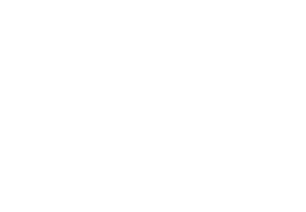
</a>

---

## 🖼️ IMÁGENES DEL JUEGO

| 📌 Elemento | 📷 Imagen |
|------------|------------|
| **🎭 Personaje** | [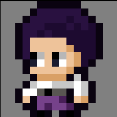](Assets/DataGameTiemposPasados/Player.png) |
| **🎮 Banner** | [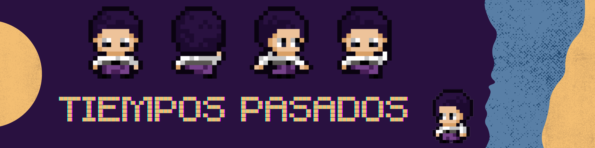](Assets/DataGameTiemposPasados/TiemposPasadosBaner.png) |
| **🎨 Portada** |  |
| **🚀 Start Game** | [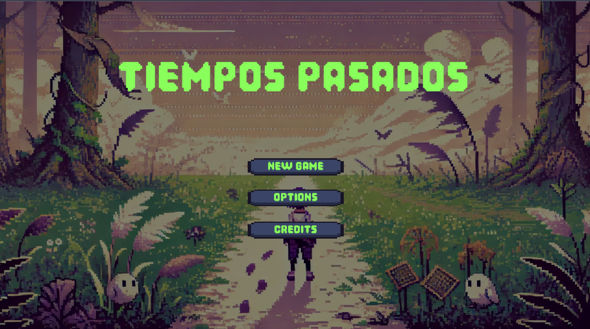](Assets/DataGameTiemposPasados/StarGame.png) |
| **📖 Instrucciones** | [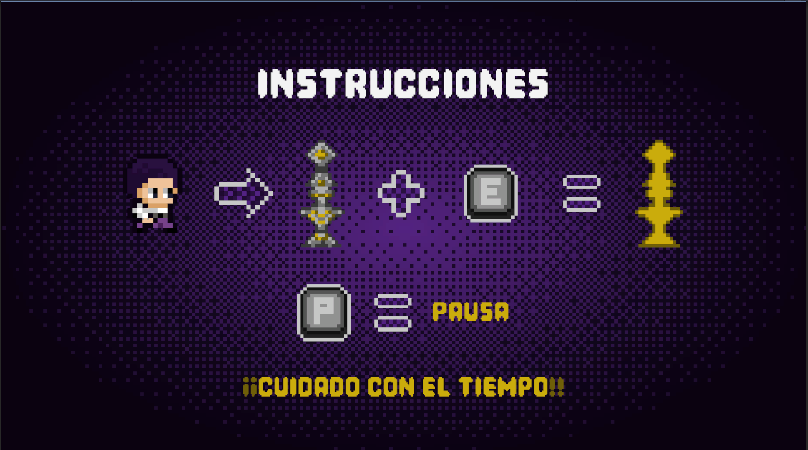](Assets/DataGameTiemposPasados/Instruciones.png) |
| **🎚️ Ajustes de Volumen** | [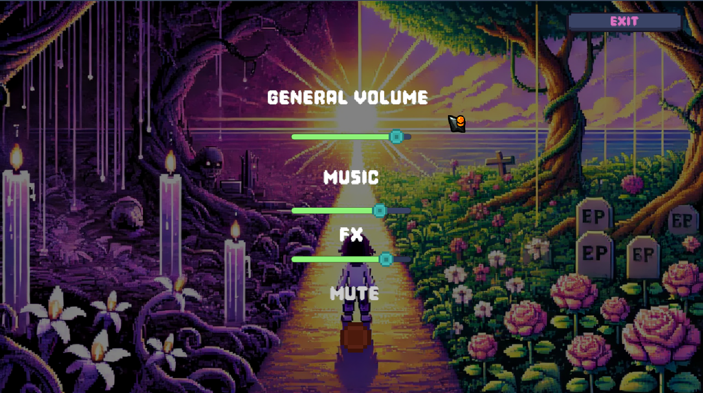](Assets/DataGameTiemposPasados/AjustesVolume.png) |
| **🗺️ Mundo** | [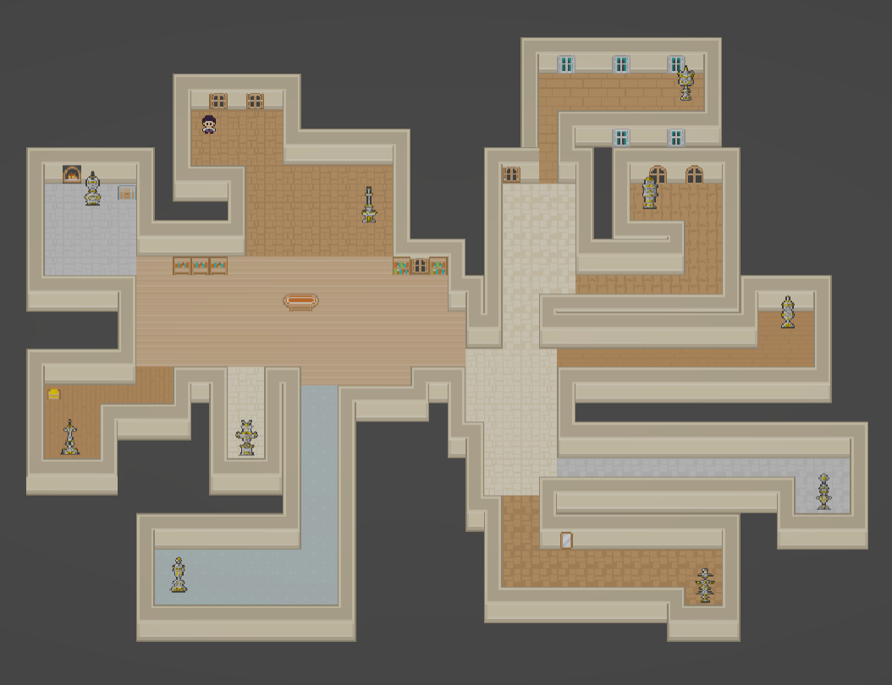](Assets/DataGameTiemposPasados/Mapa.png) |
| **🕹️ Gameplay** | [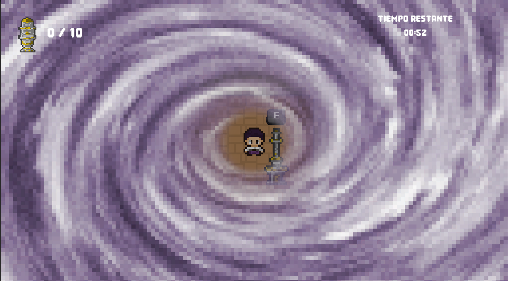](Assets/DataGameTiemposPasados/Game.png) |
| **🏆 Ganar** |  |
| **💀 Game Over** | [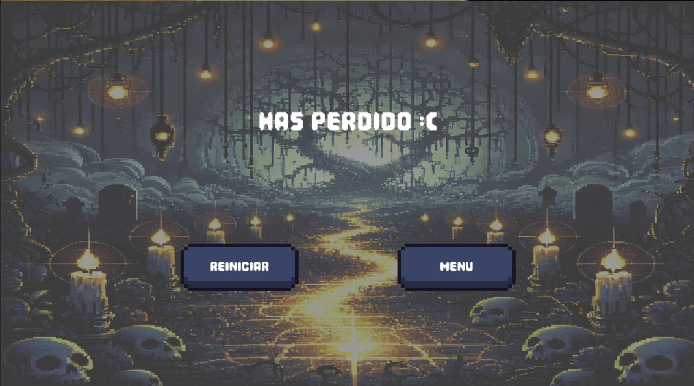](Assets/DataGameTiemposPasados/GameOver.png) |
| **⏸️ Pausa** | [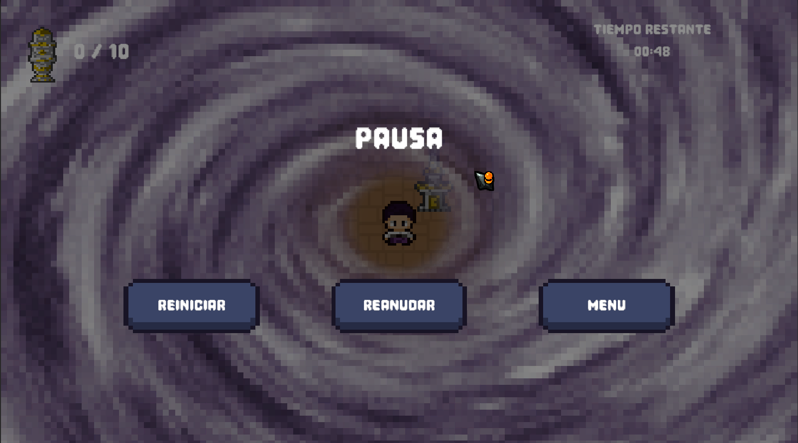](Assets/DataGameTiemposPasados/Pausa.png) |
| **📜 Créditos** | [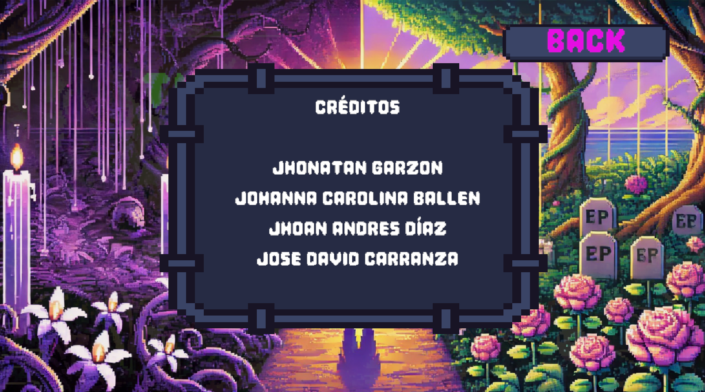](Assets/DataGameTiemposPasados/Creditos.png) |
| **🗿 Monumentos** | [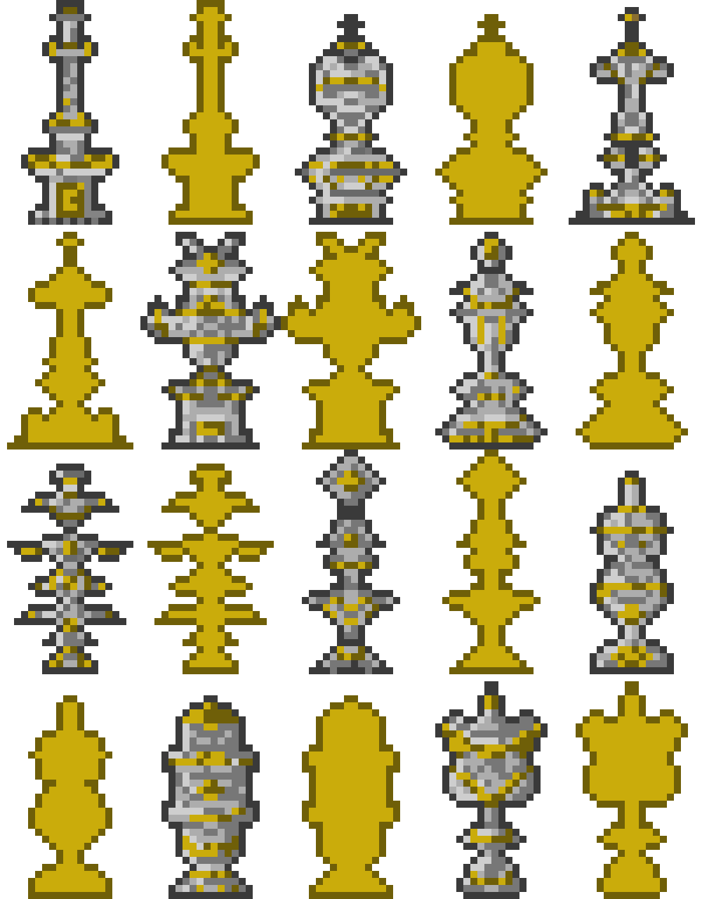](Assets/DataGameTiemposPasados/Monumentos.png) |

